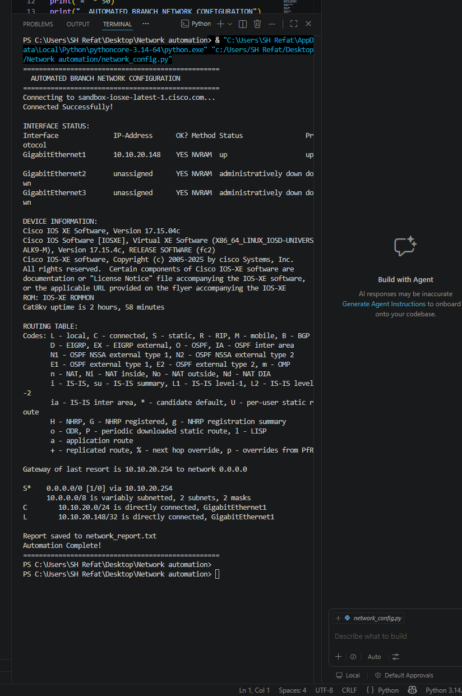

# Automated Branch Network Configuration

## What This Project Does
A Python automation script that connects to a Cisco IOS XE router via SSH and automatically collects network data — eliminating hours of manual CLI work.

## Problem It Solves
Network engineers manually SSH into devices one by one to check interfaces, routing tables, and device information. This script automates the entire process in seconds.

## Technologies Used
- Python 3.14
- Netmiko library
- Cisco IOS XE (Cat8kv)
- SSH protocol

## How It Works
1. Script SSHs into Cisco router automatically
2. Pulls interface status
3. Pulls device information  
4. Pulls routing table
5. Saves everything to a report file
## Network Topology


## Script Output



## Results
- Connected to real Cisco IOS XE router
- Extracted live network data automatically
- Generated automated report

## Files
- `network_config.py` — Main automation script
- `network_report.txt` — Auto-generated report
- `topology.png` — Network topology diagram

## How To Run
```
pip install netmiko
py network_config.py
```
